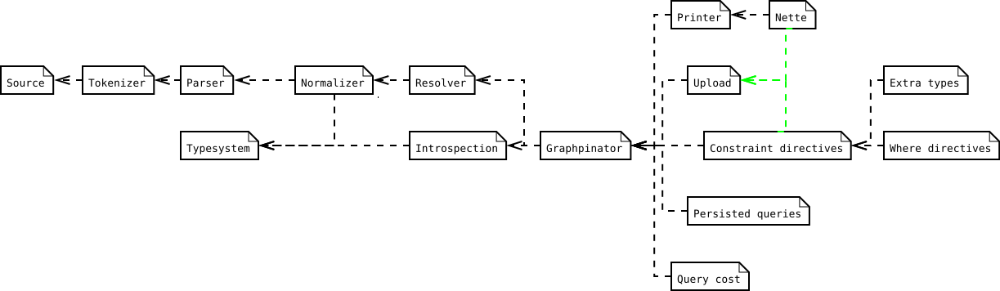

# GraPHPinator [](https://github.com/infinityloop-dev/graphpinator/actions?query=branch%3Amaster) [](https://codecov.io/gh/infinityloop-dev/graphpinator)

:zap::globe_with_meridians::zap: Easy-to-use & Fast GraphQL server implementation for PHP.

## Introduction

Feature complete PHP implementation of GraphQL server. Its job is transformation of query string into resolved Json result for a given Schema. 

- Aims to be compliant with the latest draft of GraphQL specification.
- Fully typesafe, and therefore minimum required PHP version is 8.0. Sacrifices a tiny bit of convenience for huge amount of clarity and safety - no random configuration `array`s, no mixed types, no variable function arguments - this library doesnt try to save you from verbosity, but makes sure you always know what you've got.
- Code first.
- Flexible. Easy to extend with extra functionality using Modules or middleware Directives.
- Includes some opt-in extensions which are out of scope of official specs:
    - [Printer](https://github.com/infinityloop-dev/graphpinator-printer) - Schema printing for GraPHPinator typesystem.
    - [Extra types](https://github.com/infinityloop-dev/graphpinator-extra-types) - Some useful and commonly used types, both scalar or composite.
    - [Constraint directives](https://github.com/infinityloop-dev/graphpinator-constraint-directives) - Typesystem directives to declare additional validation on top of GraphQL typesystem.
    - [Where directives](https://github.com/infinityloop-dev/graphpinator-where-directives) - Executable directives to filter values in lists.
    - [Upload](https://github.com/infinityloop-dev/graphpinator-upload) - Module to handle [multipart-formdata](https://github.com/jaydenseric/graphql-multipart-request-spec) requests.
    - [Query cost](https://github.com/infinityloop-dev/graphpinator-query-cost) - Modules to limit query cost by restricting maximum depth or number of nodes.
    - [Persisted queries](https://github.com/infinityloop-dev/graphpinator-persisted-queries) - Module to persist validated query in cache and improve performace of repeating queries.
- Includes adapters for easy integration into other PHP frameworks:
    - [Nette](https://github.com/infinityloop-dev/graphpinator-nette) - Adapters for [Nette framework](https://nette.org/).
- Project is composed of multiple smaller packages, which may be used standalone:
    - [Tokenizer](https://github.com/infinityloop-dev/graphpinator-tokenizer) - Lexical analyzer of GraphQL document.
    - [Parser](https://github.com/infinityloop-dev/graphpinator-parser) - Syntactic analyzer of GraphQL document.

## Installation

Install package using composer

```composer require infinityloop-dev/graphpinator```

## Dependencies

- PHP 8.0.1+ 
    - Latest PHP 7.4+ version is 0.25.x [](https://github.com/infinityloop-dev/graphpinator/actions?query=branch%3Aphp74_bugfixes) [](https://codecov.io/gh/infinityloop-dev/graphpinator)
- [infinityloop-dev/utils](https://github.com/infinityloop-dev/utils)
- [psr/http-message](https://github.com/php-fig/http-message)
- [psr/log](https://github.com/php-fig/log)

This list excludes graphpinator sub-packages such as graphpinator-common, graphpinator-tokenizer and others.

### Dependency tree of graphpinator packages and extensions



## How to use

- Visit our simple [Hello world example](https://github.com/infinityloop-dev/graphpinator/blob/master/docs/examples/HelloWorld.md).
- Or visit [the complete Docs](https://github.com/infinityloop-dev/graphpinator/blob/master/docs/README.md).

## Contributing

This package is relatively new, so some features might be missing. If you stumble upon something that is not included or is not compliant with the specs, please inform us by creating an issue or discussion. This is not yet another package, where issues and pull-requests lie around for months, so dont hesitate and help us improve the library.
